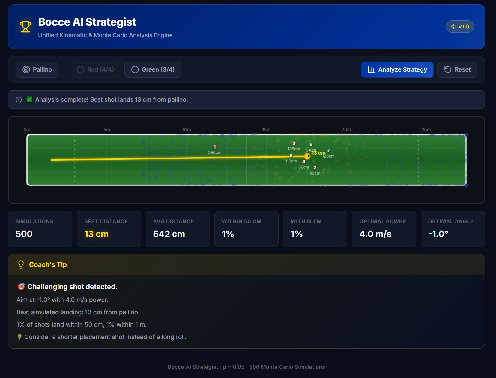

# 🏆 Bocce AI Strategist

Bocce AI Strategist is a React-based web application providing a unified Kinematic and Monte Carlo analysis engine for the sport of Bocce. Designed with a heavy emphasis on accessibility, this tool is built for Special Olympics athletes and their coaches to be used directly on the court via an iPad or smartphone.




## 🌟 Key Features

*   **Accessible "Tap-to-Drop" Interface:** Completely built without drag-and-drop mechanics. Users can simply tap to select a ball and tap the canvas to place it, ensuring frictionless usability for those with limited fine motor control.
*   **Massive Mobile UI Zones:** The UI features high-contrast "Special Olympics" branding (Cobalt Blue, Vivid Red, Bright Yellow) and transforms into a thumb-friendly fixed bottom navigation bar on mobile devices.
*   **Kinematic Engine:** Uses a custom physics engine ($\mu = 0.05$ rolling friction) to accurately calculate ball deceleration and stop positions.
*   **Monte Carlo Analysis Engine:** Runs 500 stochastic simulations in the background, testing various launch angles ($\pm15^\circ$) and power levels ($\pm40\%$) to find the optimal throw.
*   **Visual Strategy Tools:**
    *   **Probability Cloud:** Renders the 500 potential outcomes as a heat-map of transparent dots.
    *   **Optimal Path:** Highlights the most successful simulated trajectory with a bold, glowing yellow line.
*   **Coach's Tip AI:** Generates actionable, plain-English strategic feedback based on the raw statistical outputs of the simulation.

## 🚀 Getting Started

### Prerequisites
*   Node.js (v16 or higher)
*   npm

### Installation

1.  Clone the repository:
    ```bash
    git clone https://github.com/jakelee2029/bocce-ai-strategist.git
    cd bocce-ai-strategist
    ```
2.  Install dependencies:
    ```bash
    npm install
    ```
3.  Start the development server:
    ```bash
    npm run dev
    ```
4.  Open `http://localhost:5173/` in your browser.

## 🗺️ Roadmap (The 10x Vision)

*   **Computer Vision Tracking:** Utilize the device camera to automatically plot the real-world positions of the balls onto the digital canvas.
*   **Augmented Reality (AR):** Project the Monte Carlo optimal path calculation directly onto the physical court surface.

## 🛠️ Technology Stack
*   **Frontend:** React (Vite)
*   **Canvas API:** HTML5 HiDPI Canvas for rendering the court and probability cloud
*   **Styling:** Vanilla CSS (Responsive, Mobile-First)
*   **Icons:** `lucide-react`
